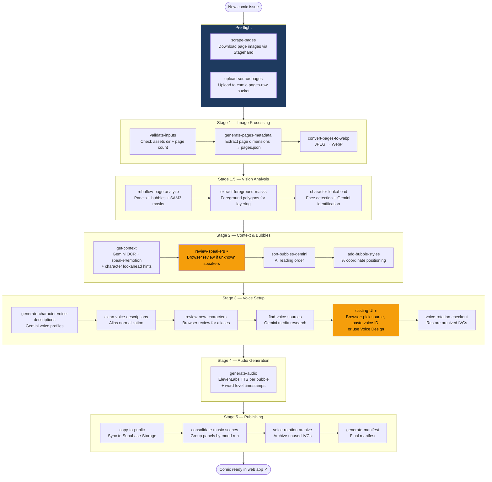

# Comic Processing Pipeline

## Overview

The pipeline transforms raw comic book page images into a fully-voiced, interactive web experience. It runs locally on your machine and is orchestrated by a single command with checkpoint/resume support.

```bash
pnpm ingest -- --book <book-id> --issue <issue-number>
```

Data is stored in Supabase (DB + Storage). The pipeline writes to Supabase; the web app reads from it.

---

## Full Pipeline Flow



---

## Pipeline Steps (Ordered)

| # | Step ID | What it does |
|---|---------|-------------|
| 1 | `validate-inputs` | Check assets dir + pages exist |
| 2 | `generate-pages-metadata` | Extract page dimensions → DB |
| 3 | `convert-pages-to-webp` | JPEG → WebP → Supabase Storage |
| 4 | `roboflow-page-analyze` | Panels + bubbles + SAM3 segmentation via Roboflow workflow |
| 5 | `extract-foreground-masks` | Foreground polygons from SAM3 for layered rendering |
| 6 | `character-lookahead` | Face extraction + Gemini Flash identification per face → per-page character lists |
| 7 | `get-context` | Gemini OCR + speaker/emotion context (uses lookahead hints) |
| 8 | `review-speakers` | Browser pause if unknown speakers need review (`/admin/.../review/speakers`) |
| 9 | `sort-bubbles-gemini` | AI reorders bubbles for correct reading order |
| 10 | `add-bubble-styles` | Calculate % coordinates for responsive positioning |
| 11 | `generate-character-voice-descriptions` | Gemini consolidates voice descriptions per character |
| 12 | `clean-voice-descriptions` | Normalize names via alias-map |
| 13 | `review-new-characters` | Browser pause for alias assignment (`/admin/.../review/new-characters`) |
| 14 | `find-voice-sources` | Gemini researches media appearances; creates casting tasks |
| 15 | `generate-voice-models` | ElevenLabs IVC/Voice Design from sourced clips |
| 16 | `voice-rotation-checkout` | Restore archived voices for this issue's cast |
| 17 | `generate-audio` | ElevenLabs TTS per bubble + word alignment timestamps |
| 18 | `copy-to-public` | Sync WebP + audio to Supabase Storage |
| 19 | `consolidate-music-scenes` | Group panels into mood-consistent music scenes |
| 20 | `voice-rotation-archive` | Archive IVCs no longer needed (free ElevenLabs slots) |
| 21 | `generate-manifest` | Final manifest for the web app |

---

## Browser Review Pauses

When running with `STORAGE_MODE=supabase`, certain steps pause the pipeline (exit code 2) and open a browser review:

| Step | Browser URL | Purpose |
|------|-------------|---------|
| `review-speakers` | `/admin/{book}/{issue}/review/speakers` | Accept/rename/alias unknown speaker names |
| `review-new-characters` | `/admin/{book}/{issue}/review/new-characters` | Alias new characters to existing or keep as new |
| `find-voice-sources` | `/admin/characters/casting?book={book}&issue={issue}` | Source voice clips, paste voice IDs, or use Voice Design |

After completing the browser review, re-run `pnpm ingest` — it resumes from where it paused.

---

## Character Lookahead Flow


The character lookahead runs BEFORE `get-context` and provides per-page character lists. This dramatically improves speaker identification accuracy — Gemini knows who's on the page before analyzing dialogue.

---

## Voice Clip Splitting (Manual)

When sourcing voice clips for casting, use the split tool to isolate a single character from mixed audio:

```bash
pnpm split-voice -- --input clip.mp4 --character "Raphael" --book tmnt-mmpr-iii
```

Pipeline: source separation (remove music/SFX) → speaker diarization (who speaks when) → Gemini speaker ID → ffmpeg extraction. Outputs a clean WAV for ElevenLabs IVC upload.

Requires: `pip install audio-separator[cpu] pyannote.audio` + `HF_TOKEN` env var.

---

## Checkpoint / Resume

The pipeline writes a `checkpoint.json` after each step completes. If a run is interrupted, re-running the same command automatically resumes from the last successful step.

```bash
# Normal run (auto-resumes if checkpoint exists)
pnpm ingest -- --book tmnt-mmpr-iii --issue 3

# Force restart from a specific step
pnpm ingest -- --book tmnt-mmpr-iii --issue 3 --from-step generate-audio

# Preview what would run without executing
pnpm ingest -- --book tmnt-mmpr-iii --issue 3 --dry-run

# Skip interactive prompts (auto mode for terminal reviews)
pnpm ingest -- --book tmnt-mmpr-iii --issue 3 --auto
```

---

## Manual / Maintenance Scripts

| Script | When to use |
|--------|------------|
| `pnpm repair-cues` | Fix ElevenLabs `textWithCues` formatting on existing bubbles |
| `pnpm backfill-context` | Add missing `aiReasoning` fields to an existing `bubbles.json` |
| `pnpm regenerate-timestamps` | Re-fetch word timing data without re-generating audio |
| `pnpm apply-fixes` | Apply speaker/emotion corrections exported from the web review UI |
| `pnpm split-voice` | Isolate character voice from mixed audio for IVC training |
| `pnpm manage-registry` | Inspect/edit the global character registry |

---

## Gemini Model Tiers

All model strings are centralized in `src/lib/models.ts` (re-exported via `scripts/utils/models.ts`). Never hardcode inline.

| Export | Model | Used in |
|--------|-------|---------|
| `GEMINI_HIGH` | `gemini-3.1-pro-preview` | `get-context` (context analysis), `find-voice-sources` (research) |
| `GEMINI_MEDIUM` | `gemini-3-flash-preview` | OCR, `sort-bubbles-gemini`, `character-lookahead`, `scrape-pages`, `split-voice` (speaker ID) |
| `GEMINI_FAST` | `gemini-3.1-flash-lite-preview` | `repair-cues`, `regenerate-cues` (simple rule-based fixes) |

---

## Data Storage

| System | What's stored |
|--------|--------------|
| **Supabase DB** | Bubbles, panels, pages, issues, castlist, characters, aliases, music scenes, audio timestamps, casting tasks, speaker reviews |
| **Supabase Storage** | Page WebPs (`comic-pages`), audio MP3s (`comic-audio`), raw source pages (`comic-pages-raw`), voice clips (`comic-voice-clips`), audio library (SFX/ambience/music) |
| **Local `assets/`** | Source JPEGs, intermediate data files, SAM3 sidecars, checkpoint state |

---

## Admin Dashboard

The admin dashboard at `/admin` shows:
- All issues with pipeline status (Ready / Processing / Paused)
- Links to review UIs when pipeline is paused
- Quick access to panels review, bubble review, and reader

Additional admin pages:
- `/admin/new-issue` — drag-and-drop page upload
- `/admin/voices` — voice model management and rotation
- `/admin/characters/casting` — voice sourcing workflow
- `/admin/{book}/{issue}/review/speakers` — speaker name review
- `/admin/{book}/{issue}/review/new-characters` — character alias assignment
- `/admin/{book}/{issue}/review/panels` — panel bounds, bubble assignment, effect tags
