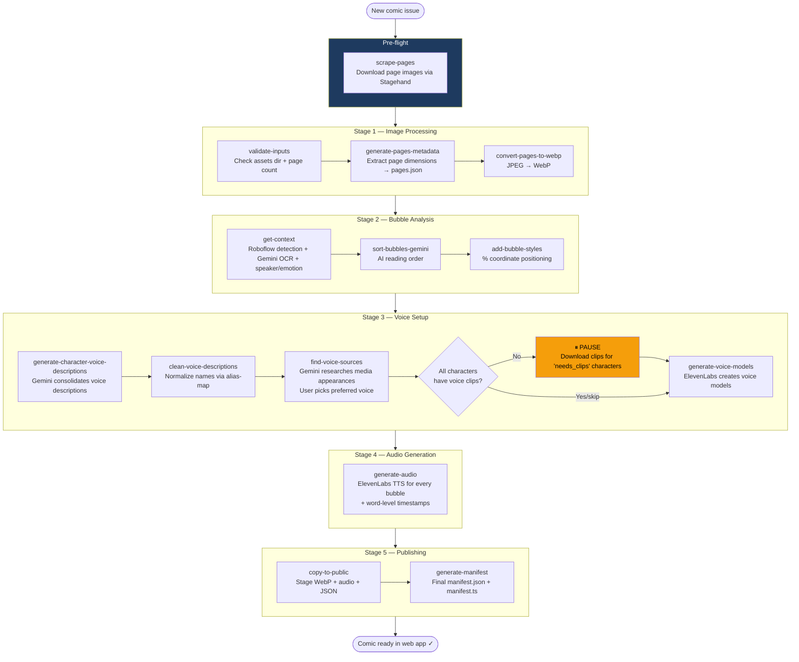
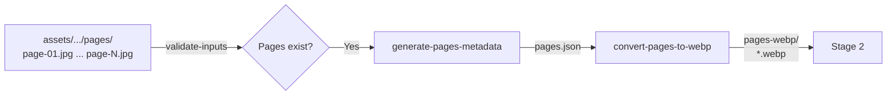
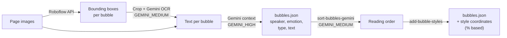
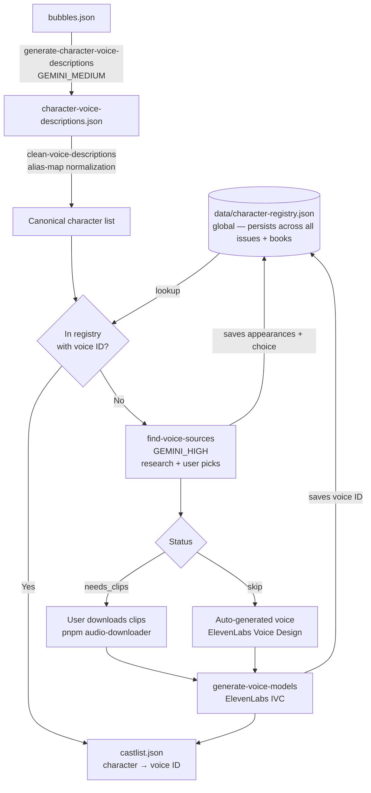
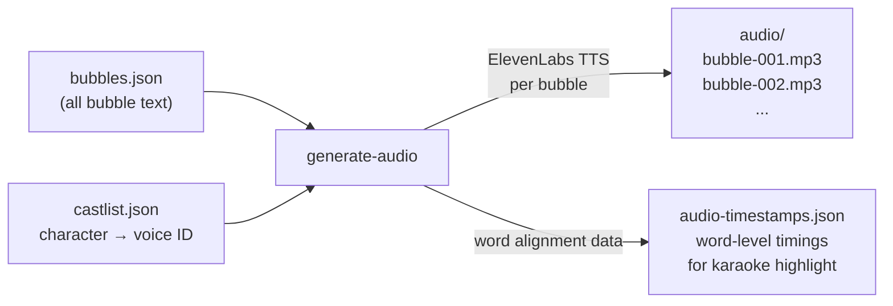

# Comic Processing Pipeline

## Overview

The pipeline transforms raw comic book page images into a fully-voiced, interactive web experience. It runs locally on your machine and is orchestrated by a single command with checkpoint/resume support.

```bash
pnpm ingest -- --book <book-id> --issue <issue-number>
```

---

## Full Pipeline Flow



---

## Step-by-Step Reference

### Pre-flight: Image Ingestion

| Script | Command | Description |
|--------|---------|-------------|
| `scrape-pages` | `pnpm scrape-pages -- --url <url> --book <id> --issue <n>` | Uses Stagehand (AI browser automation) to navigate to a comic URL and extract all page image URLs. Downloads sequentially as `page-01.jpg`, `page-02.jpg`, etc. |

> Stagehand uses `GEMINI_MEDIUM` to identify comic page images vs. thumbnails/UI chrome.

---

### Stage 1 — Image Processing



| Step | Script | Input | Output | Notes |
|------|--------|-------|--------|-------|
| 1 | `validate-inputs` | `assets/.../pages/` | — | Fails fast if pages dir is missing or empty |
| 2 | `generate-pages-metadata` | Page JPEGs | `data/pages.json` | Width/height per page for responsive layout |
| 3 | `convert-pages-to-webp` | Page JPEGs | `pages-webp/*.webp` | Resize to 1200px wide, WebP for web performance |

---

### Stage 2 — Bubble Analysis



| Step | Script | Model | Input | Output |
|------|--------|-------|-------|--------|
| 4 | `get-context` | `GEMINI_HIGH` (context), `GEMINI_MEDIUM` (OCR) | Page images + Roboflow | `data/bubbles.json` |
| 5 | `sort-bubbles-gemini` | `GEMINI_MEDIUM` | `bubbles.json` + page images | `bubbles.json` (reordered) |
| 6 | `add-bubble-styles` | — | `bubbles.json` + `pages.json` | `bubbles.json` + `style` objects |

**Bubble types detected:**
- `SPEECH` → identify speaker + emotion
- `NARRATION` / `CAPTION` → force speaker = "Narrator", emotion = "Neutral"
- `SFX` → skip (no audio generated)

---

### Stage 3 — Voice Setup



| Step | Script | Model | What happens |
|------|--------|-------|-------------|
| 7 | `generate-character-voice-descriptions` | `GEMINI_MEDIUM` | Aggregates all voice description mentions per character into one consolidated profile. Skips characters already in the global character registry. |
| 8 | `clean-voice-descriptions` | — | Normalizes character names using `alias-map.ts` (handles "Raph" → "Raphael" etc.). Cross-references registry — known characters are pre-populated. |
| 9 | `find-voice-sources` | `GEMINI_MEDIUM` | **Checks `data/character-registry.json` first.** Characters with an existing voice ID skip this step entirely. For new characters only: researches media appearances, caches results to registry, interactive terminal menu to pick preferred voice. |
| 10 | `generate-voice-models` | — | **Checks registry for existing voice IDs** — skips creation if already present. For new characters: creates ElevenLabs **IVC** (Instant Voice Clone) from sourced audio clips, or Voice Design for auto-generated minor characters. Writes voice ID back to registry and `castlist.json`. |

**Voice model type:** ElevenLabs **IVC (Instant Voice Clone)** — works with a few minutes of sourced audio clips. PVC (Professional Voice Clone) requires 30+ minutes of single-speaker audio and is not used here.

**Human pause point:** After step 9, the pipeline pauses. For any character with `status: "needs_clips"`, the user runs `pnpm audio-downloader` with the YouTube URL to download and stage the audio clips before continuing.

**Character registry:** `data/character-registry.json` is a global file at the project root (not per-issue). It persists media appearance research and voice IDs across all issues and books. Re-processing the same series skips voice setup for known characters entirely.

---

### Stage 4 — Audio Generation



| Step | Script | Input | Output | Notes |
|------|--------|-------|--------|-------|
| 11 | `generate-audio` | `bubbles.json` + `castlist.json` | `audio/*.mp3` + `audio-timestamps.json` | Calls ElevenLabs TTS API once per bubble. Word-level timestamps enable karaoke highlighting in the reader. |

---

### Stage 5 — Publishing

| Step | Script | Input | Output |
|------|--------|-------|--------|
| 12 | `copy-to-public` | `pages-webp/`, `audio/`, `bubbles.json` | `public/comics/<book>/<issue>/` |
| 13 | `generate-manifest` | `assets/` directory tree | `public/comics/manifest.json` + `src/data/manifest.ts` |

---

## Data Files Reference

```
assets/comics/<book>/issue-<n>/
  pages/                          ← Source JPEGs (never in public/)
  pages-webp/                     ← Converted WebP (intermediate)
  audio/                          ← Generated MP3 files
  data/
    pages.json                    ← Page dimensions (Stage 1 output)
    bubbles.json                  ← The core data file — everything about every bubble
    character-voice-descriptions.json  ← Consolidated per-character voice profiles
    voice-sourcing-suggestions.json    ← Gemini's media appearance research
    source-material.json          ← Character → chosen voice source + status
    castlist.json                 ← Character → ElevenLabs voice ID (final)
    audio-timestamps.json         ← Word-level timing for karaoke highlight
    gemini-context/               ← Per-page Gemini analysis cache (speeds up reruns)
  checkpoint.json                 ← Pipeline progress (auto-managed, gitignored)
```

---

## Checkpoint / Resume

The pipeline writes a `checkpoint.json` after each step completes. If a run is interrupted (API error, rate limit, crash), re-running the same command automatically resumes from the last successful step.

```bash
# Normal run (auto-resumes if checkpoint exists)
pnpm ingest -- --book tmnt-mmpr --issue 4

# Force restart from a specific step
pnpm ingest -- --book tmnt-mmpr --issue 4 --from-step generate-audio

# Preview what would run without executing
pnpm ingest -- --book tmnt-mmpr --issue 4 --dry-run
```

---

## Manual / Maintenance Scripts

These run outside the main pipeline to fix issues discovered during review.

| Script | When to use |
|--------|------------|
| `pnpm repair-cues` | Fix ElevenLabs `textWithCues` formatting on existing bubbles |
| `pnpm backfill-context` | Add missing `aiReasoning` fields to an existing `bubbles.json` |
| `pnpm regenerate-timestamps` | Re-fetch word timing data without re-generating audio |
| `pnpm apply-fixes` | Apply speaker/emotion corrections exported from the web review UI |
| `pnpm sort-bubbles` | Re-sort bubbles by position (simple Y then X, no AI) |

---

## Gemini Model Tiers

All model strings are centralized in `scripts/utils/models.ts`. Never hardcode inline.

| Export | Model | Used in |
|--------|-------|---------|
| `GEMINI_HIGH` | `gemini-3.1-pro-preview` | `get-context` (context analysis), `find-voice-sources` (research) |
| `GEMINI_MEDIUM` | `gemini-3-flash-preview` | `get-context` (OCR), `sort-bubbles-gemini`, `generate-character-voice-descriptions`, `scrape-pages` |
| `GEMINI_FAST` | `gemini-3.1-flash-lite-preview` | `repair-cues` (simple rule-based fixes) |
