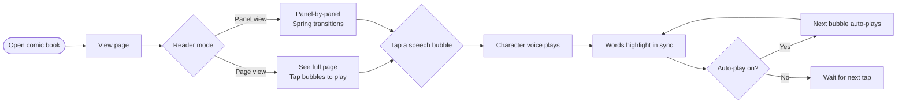
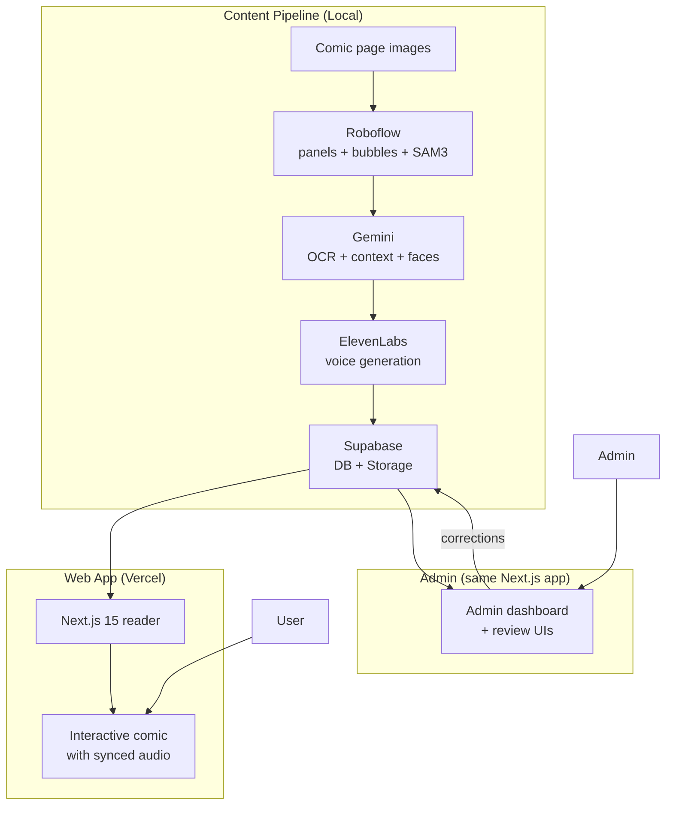

# Comic Reader — Product Overview

## What It Is

An interactive comic book reader that brings comics to life for kids learning to read. Think **Audible meets Kindle**, but for comic books — each speech bubble plays the character's voice with words highlighting in sync (karaoke-style), panels transition with spring physics, and particle effects layer between background and foreground characters.

Built as a personal project for family use. Not for sale.

---

## Why It Exists

Kids learning to read get better with exposure and repetition, but "reading is for nerds" competes with short-form video for attention. Comics are visually engaging and narrative-driven, but younger readers still need help decoding the text. This app bridges that gap — a parent reading comics aloud to kids, but on demand and on a road trip.

The features that make it work:
- **Character voices**: each character sounds like their canonical voice (Raphael sounds like Raphael, not generic TTS)
- **Word highlighting**: the active word lights up as it's spoken, helping connect printed text to spoken sound
- **Panel-by-panel reading**: Kindle-style panel view with spring-animated transitions keeps focus on one moment at a time
- **Layered rendering**: particle effects flow behind characters, creating depth and motion

---

## How It Works (User Perspective)



### Reader Modes

| Mode | Behavior |
|------|----------|
| **Page view** | See the full page. Tap any bubble to play its audio. |
| **Panel view** | Kindle-style: one panel at a time with spring-animated transitions. Persists across page navigation. |
| **Manual play** | Tap any bubble to play it. Nothing auto-advances. |
| **Auto-play** | Tap the first bubble. Each bubble plays in reading order automatically. |

### Controls
- **Tap a bubble** → play that character's voice
- **Swipe left/right** → next/previous page (or panel in panel-view)
- **Tap page edges** → next/previous page (Kindle-style)
- **Single tap center** → toggle chrome (top/bottom bars)
- **Auto-play toggle** → bottom control bar
- **Page selector** → grid of all pages, tap to jump
- **Pinch to zoom** → 1× to 3.5×
- **Panel/page toggle** → view mode selector

---

## What the Reader Renders

Each panel is a directed mini-scene with layered rendering:

```
┌─────────────────────────────────────┐
│         Background layer            │  ← Page art (WebP)
│    ┌─────────────────────────┐      │
│    │   Particle effects      │      │  ← CSS animations (fire, smoke, energy)
│    │   (behind characters)   │      │
│    ├─────────────────────────┤      │
│    │   Foreground layer      │      │  ← SVG clip-path from SAM3 masks
│    │   (characters)          │      │
│    ├─────────────────────────┤      │
│    │   Speech bubbles        │      │  ← Positioned overlays with audio
│    │   + karaoke highlight   │      │
│    └─────────────────────────┘      │
│                                     │
│    ♪ Music scene (continuous)       │  ← Doesn't restart on panel change
└─────────────────────────────────────┘
```

---

## Tech Stack



| Layer | Technology | Purpose |
|-------|-----------|---------|
| Frontend | Next.js 15, React 19, Tailwind | Reader + admin web app |
| Database | Supabase (Postgres) | All structured data (bubbles, panels, characters, etc.) |
| Storage | Supabase Storage | Page WebPs, audio MP3s, source pages, voice clips |
| Bubble/panel detection | Roboflow workflow | Bounding boxes + SAM3 segmentation masks |
| OCR + context | Google Gemini | Text extraction, speaker ID, emotion, reading order |
| Face identification | Google Gemini Flash | Character lookahead — who's on each page |
| Voice cloning | ElevenLabs IVC | Main characters — cloned from sourced audio clips |
| Voice generation | ElevenLabs Voice Design | Minor characters — generated from text description |
| Image processing | sharp | JPEG → WebP conversion, face cropping |
| Audio splitting | audio-separator + pyannote | Isolate character voice from mixed audio |
| Deployment | Vercel | Hosts the Next.js app |

---

## Content

Currently live:
- **TMNT × MMPR Part III** — Issues 1, 2, and 3 (in progress)

Characters have custom voice models built from sourced audio clips of the original voice actors (ElevenLabs IVC). Minor characters use Voice Design.

---

## Adding a New Book

The goal is "add a new book in a single afternoon":

1. **Scrape pages** → `pnpm scrape-pages -- --url <url> --book <id> --issue <n>`
2. **Run pipeline** → `pnpm ingest -- --book <id> --issue <n>`
3. **Browser reviews** → pipeline pauses at review steps; complete in browser
4. **Source voice clips** → download clips, run `pnpm split-voice`, create IVC in ElevenLabs
5. **Resume pipeline** → `pnpm ingest -- --book <id> --issue <n>` (auto-resumes)

Human time per issue: ~30 minutes of review + voice sourcing. The rest is automated.

---

## What It Is Not

- Not a comic reader that sources or streams licensed comics — you bring your own page images
- Not a product for sale — personal/family use only
- Not a cloud service — the processing pipeline runs locally (browser admin reviews via Vercel deployment)
- Not an episode generator — the video/cinematic pipeline is paused (too expensive, out of scope)
