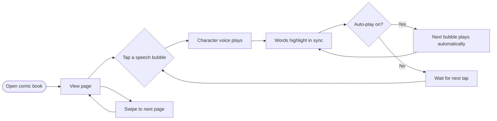
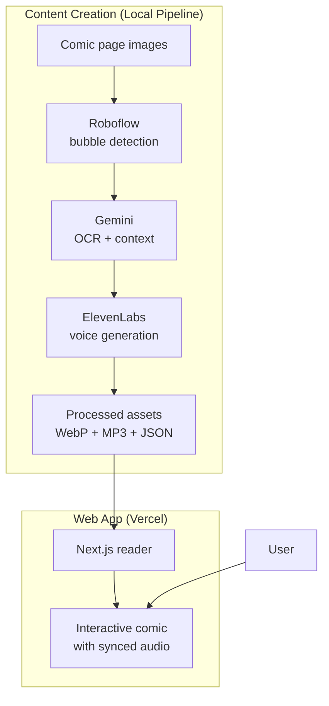

# Comic Reader — Product Overview

## What It Is

An interactive comic book reader that brings comics to life for kids learning to read. Think **Audible meets Kindle**, but for comic books — each speech bubble can be tapped to play the character's voice, and the words in the bubble highlight in sync with the audio as they're spoken (karaoke-style).

Built as a personal project for family use. Not for sale.

---

## Why It Exists

Kids learning to read get better with exposure and repetition, but "reading is for nerds" competes with short-form video for attention. Comics are visually engaging and narrative-driven, but younger readers still need help decoding the text. This app bridges that gap — a parent reading comics aloud to kids, but on demand and on a road trip.

The two features that make it work:
- **Character voices**: each character sounds like their canonical voice (Raphael sounds like Raphael, not generic TTS)
- **Word highlighting**: the active word lights up as it's spoken, helping connect printed text to spoken sound

---

## How It Works (User Perspective)

### Reader Modes

| Mode | Behavior |
|------|----------|
| **Manual** | Tap any bubble to play it. Nothing auto-advances. |
| **Auto-play** | Tap the first bubble. Each bubble plays in reading order, pauses briefly, then the next one starts automatically. |

### Controls
- **Tap a bubble** → play that character's voice
- **Swipe left/right** → next/previous page
- **Tap page edges** → next/previous page (Kindle-style)
- **Auto-play toggle** → bottom control bar
- **Page selector** → grid of all pages, tap to jump
- **Pinch to zoom** → 1× to 3.5×

---

## Tech Stack (High Level)

| Layer | Technology | Purpose |
|-------|-----------|---------|
| Frontend | Next.js 15, React 19, Tailwind | The reader web app |
| Bubble detection | Roboflow | Finds bounding boxes for each speech bubble |
| OCR | Google Gemini | Reads the text inside each bubble |
| Context | Google Gemini | Identifies speaker, emotion, bubble type |
| Voice cloning | ElevenLabs PVC | Main characters — cloned from sourced audio clips |
| Voice generation | ElevenLabs Voice Design | Minor/one-off characters — generated from AI description |
| Image processing | sharp | Converts source JPEGs to optimized WebP |
| Deployment | Vercel | Hosts the Next.js app |

---

## Content in the App

Currently live:
- **TMNT × MMPR Part 3** — Issues 1 and 2

Characters have custom voice models built from sourced audio clips of the original voice actors.

---

## What It Is Not

- Not a comic reader that sources or streams licensed comics — you bring your own page images
- Not a product for sale — personal/family use only
- Not a cloud service — the processing pipeline runs locally on your machine

---

## Future Ideas

- **Sound effects**: onomatopoeia words (BOOM, CRASH) trigger actual sound effects
- **Background music**: ambient score behind pages
- **Video generation**: use the processed panels + audio as a script to generate an animated episode
