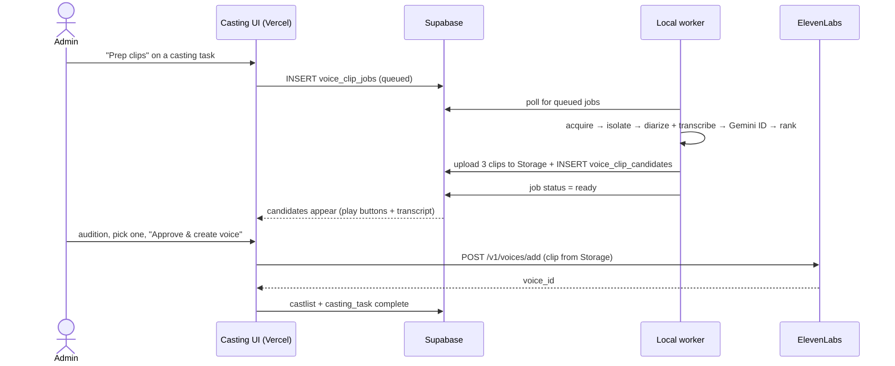

# Feature: Voice Clip Candidates (local prep behind the casting gate)

## Status: `pending`

---

## Purpose

Automate the grunt work behind the casting pause so the human gate becomes
"listen to three clips, pick one, click" instead of a detour through YouTube,
a terminal, and the ElevenLabs dashboard.

Today the casting UI hands you `youtubeSearchTerms` and stops. Everything after
that is manual: find the video, download it, isolate the character, trim a
usable clip, create the IVC in ElevenLabs' web UI, copy the voice ID back into
the admin page (`casting/actions.ts:23` — *"User downloaded a clip locally,
created an IVC voice in the ElevenLabs [UI]"*).

This feature keeps the gate and the human judgment call — a wrong voice is worse
than a slow one — and replaces the chore around it.

**All heavy processing stays local.** Separation, diarization, and transcription
run on this machine with free tooling. The only paid calls are the existing
Gemini speaker-ID (`GEMINI_MEDIUM`, already in `split-voice-clip.ts`) and the
final ElevenLabs IVC creation, which only fires on explicit human approval.

---

## Before / after

| Step | Today | After |
|---|---|---|
| Find source | User reads Gemini's search terms, browses YouTube | Worker acquires from local library or YouTube |
| Isolate voice | User does it by hand, or not at all | Center channel (5.1) or `audio-separator` |
| Pick a usable segment | User scrubs the file | Diarize + rank, top 3 surfaced |
| Create voice | ElevenLabs dashboard, by hand | "Approve & create" button → `/v1/voices/add` |
| Record the voice ID | Copy/paste into admin | Automatic |

---

## Architecture

Follows the `scripts/ingest-worker.ts` precedent — the cloud coordinates, the
local machine does the expensive work and writes results back to Supabase.



The casting hook (`ingest-pipeline.ts:178`) is untouched. Only the content of
the gate changes.

---

## Local processing chain

### 1. Acquire

Two modes, same downstream:

- **`local`** — a file path in the media library. Preferred when available.
- **`youtube`** — `yt-dlp` using the terms already produced by
  `researchCharacter`. Audio-only (`-f bestaudio`).

### 2. Isolate

**Fast path — 5.1 center channel.** If `ffprobe` reports ≥6 channels, dialogue
is center-locked and one ffmpeg call gets near-clean speech:

```bash
ffmpeg -i in.mkv -map 0:a:0 -af "pan=mono|c0=FC" -ar 44100 -ac 1 clean.wav
```

This is both faster and cleaner than source separation, and it skips
`audio-separator` entirely — the existing `--skip-separation` flag on
`split-voice-clip.ts` already models this case.

**Fallback — `audio-separator`.** For stereo sources and anything from YouTube.
Expect lower ceiling: YouTube audio is already lossy and separation is a
reconstruction, so plan on IVC-grade output rather than PVC-grade.

The non-center channels of a 5.1 mix are a dialogue-free music/effects bed.
Not used here, but worth keeping — it's free source material for the
`audio-library` and `music-scenes` work.

### 3. Diarize + transcribe

- `pyannote` for speaker turns (already wired in `split-voice-clip.ts`, needs `HF_TOKEN`).
- Local Whisper (`faster-whisper` or `whisper.cpp`) for word-level transcript.

Run both, align on timestamps. The transcript is not optional bookkeeping — it
materially improves the next step.

### 4. Identify the character

Reuse the existing Gemini step, but feed it the transcript alongside the audio.
Dialogue is a much stronger signal than voice timbre alone: "gotta go fast"
identifies Sonic more reliably than any acoustic feature. Cheap, and it uses
`GEMINI_MEDIUM` exactly as today.

### 5. Rank and slice

Score each candidate window for IVC suitability:

| Signal | Why |
|---|---|
| Total speech duration | IVC wants ~1–3 min of the target speaker |
| Segment contiguity | One 40s turn beats forty 1s fragments |
| No overlapping speech | `pyannote` flags overlap — reject those windows |
| Residual non-voice energy | Proxy for music bleed after isolation |
| Transcript coverage | A window Whisper couldn't read is a window to distrust |

Emit the **top 3** concatenations, each ~60–120s, as separate candidates. Three
gives the human a real choice without turning the gate into a chore.

---

## Schema

Mirrors the `casting_tasks` pattern.

```sql
CREATE TABLE voice_clip_jobs (
  id            uuid primary key default gen_random_uuid(),
  character_id  text not null references characters(id),
  book_id       text not null,
  issue_id      text not null,
  source_kind   text not null,          -- 'local' | 'youtube'
  source_ref    text not null,          -- file path or search term / URL
  status        text not null default 'queued',
                                        -- queued|claimed|running|ready|failed
  claimed_by    text,                   -- worker hostname
  claimed_at    timestamptz,
  error         text,
  created_at    timestamptz default now(),
  completed_at  timestamptz
);

CREATE INDEX voice_clip_jobs_queued ON voice_clip_jobs(status, created_at)
  WHERE status = 'queued';

CREATE TABLE voice_clip_candidates (
  id             uuid primary key default gen_random_uuid(),
  job_id         uuid not null references voice_clip_jobs(id) ON DELETE CASCADE,
  character_id   text not null references characters(id),
  clip_path      text not null,         -- storage path in voice-clips bucket
  duration_sec   real not null,
  score          real not null,         -- ranking score, higher = better
  transcript     text,                  -- what's said in this clip
  source_detail  jsonb,                 -- {title, timestamps, speakerLabel, isolation}
  is_chosen      boolean default false,
  created_at     timestamptz default now()
);

CREATE INDEX voice_clip_candidates_job ON voice_clip_candidates(job_id, score DESC);
```

**Storage bucket:** `voice-clips` — follows the `comic-character-faces`
precedent.

```
voice-clips/{bookId}/{characterId}/{jobId}/candidate-01.mp3
```

Transcripts persist on the candidate row rather than as loose files, per the
CLAUDE.md rule that structured data lives in Supabase.

---

## Shared module extraction

`scripts/split-voice-clip.ts` (518 lines) already implements acquire → separate →
diarize → Gemini ID → slice for a single character with an interactive prompt.
Rather than fork it, extract the core into `src/lib/voice-clips/` and have both
callers use it — the same pattern `workflow-lookahead-integration.md` used to
unify the lookahead code.

| Module | Responsibility |
|---|---|
| `src/lib/voice-clips/acquire.ts` | Local file or yt-dlp → wav |
| `src/lib/voice-clips/isolate.ts` | Channel probe, center-channel path, separation fallback |
| `src/lib/voice-clips/diarize.ts` | pyannote + Whisper, aligned |
| `src/lib/voice-clips/identify.ts` | Gemini speaker → character (transcript-assisted) |
| `src/lib/voice-clips/rank.ts` | Scoring + top-N window selection |

`split-voice-clip.ts` becomes a thin CLI over these; the worker is a second thin
caller. No behavior change to the existing command.

---

## UI changes

`CastingClient.tsx` Phase 2 (cast phase), per card:

- **"Prep clips"** button → enqueues a `voice_clip_jobs` row. Shows a spinner
  while `status` is `queued`/`running`.
- **Candidate list** once ready — three rows, each with an inline `<audio>`
  player, duration, score, and the transcript snippet.
- **"Approve & create voice"** — POSTs the chosen clip to ElevenLabs
  `/v1/voices/add`, stores the returned `voice_id` via the existing
  `saveVoiceId` path, marks `is_chosen`, completes the casting task.
- **"None of these"** — falls back to today's manual paste field, which stays.

Existing `researchCharacter`, `createVoiceDesign`, `bulkVoiceDesign`, and
`skipAndAddLater` are untouched. Voice Design remains the right answer for
minor characters where sourcing a clip isn't worth it.

---

## Dependencies

Already present: `ffmpeg`, `ffprobe`, `mkvextract`.

Needs installing on the worker machine:

```bash
brew install yt-dlp
pip install "audio-separator[cpu]" pyannote.audio faster-whisper
# HF_TOKEN required for pyannote
```

Nothing new is required on Vercel — the hosted side only reads DB rows and
Storage objects.

---

## Cost

| Stage | Cost |
|---|---|
| Acquire, isolate, diarize, transcribe, rank | Free (local) |
| Gemini speaker ID | `GEMINI_MEDIUM`, one call per job — unchanged from today |
| ElevenLabs IVC creation | Only on explicit approval; same spend as the manual flow |

ElevenLabs Audio Isolation and Scribe were considered and rejected — they'd
replace free local tooling with metered API calls for the same result. The
local chain also removes any per-minute billing concern on bulk runs.

Note that IVC voice **slots** are the real scarce resource, not credits — see
`voice-rotation-*.ts`. This feature doesn't change slot pressure, since it
creates exactly one voice per approval, same as today.

---

## Implementation order

1. Schema migration — `voice_clip_jobs`, `voice_clip_candidates`, `voice-clips` bucket.
2. Extract `src/lib/voice-clips/` from `split-voice-clip.ts`; keep the CLI green.
3. Add the center-channel fast path in `isolate.ts` (biggest quality win, smallest change).
4. Add Whisper transcription + transcript-assisted `identify.ts`.
5. Write `rank.ts` and emit top-3 instead of one concatenation.
6. `scripts/voice-clip-worker.ts` — poll, claim, run, upload, write rows.
7. Casting UI: "Prep clips" button + candidate list with players.
8. "Approve & create voice" → `/v1/voices/add` wiring.

Steps 1–5 are useful on their own: they improve `pnpm split-voice` immediately,
before any worker or UI exists. Ship them first and evaluate before committing
to 6–8.

---

## Verification

```bash
# Local chain only — no worker, no UI, no ElevenLabs spend
pnpm split-voice -- \
  --input "/Volumes/Seagate 4TB/media/library/shows/Teenage Mutant Ninja Turtles (2003)/Season 01/<ep>.mkv" \
  --character Raphael

# Expect: center-channel path taken (5.1 detected), separation skipped,
# 3 ranked candidates written, transcript non-empty on each.

# Then A/B the best candidate against the clip currently backing Raphael's
# voice before regenerating anything.

pnpm typecheck && pnpm lint && pnpm format:check
```

Worker verification once built: enqueue a job from the casting UI, confirm the
worker claims it, confirm three playable candidates appear in the browser.

---

## Open questions

- **Which series per character?** Voice actors differ across TMNT 1987 / 2003 /
  2007 / the live-action films. Pick a canonical series per character and record
  it, or the cast will drift between issues. The 2003 run is the natural anchor
  for TMNT — 68 episodes on hand, one consistent cast.
- **Crossover gap.** No MMPR content in the local library, so the Ranger half of
  TMNT x MMPR still comes from YouTube and will sit at a lower fidelity tier
  than the Turtles. Worth deciding whether that mismatch is acceptable before a
  bulk re-cast.
- **Transcript reuse.** Once a labeled dialogue corpus exists, it could ground
  speaker ID in `get-context` (catchphrase matching), voice descriptions, and a
  pronunciation dictionary for proper nouns. Out of scope here — noted so the
  transcripts get stored in a queryable place rather than thrown away.
