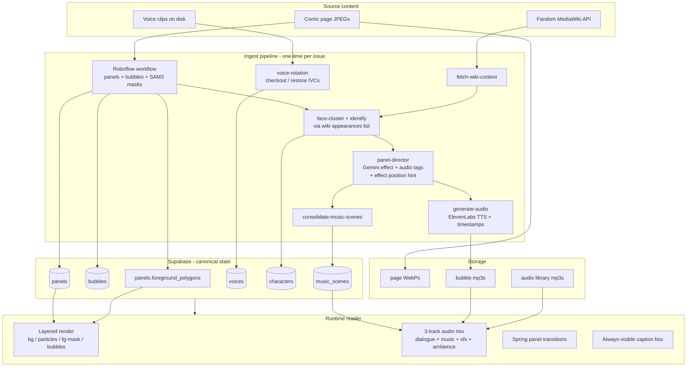
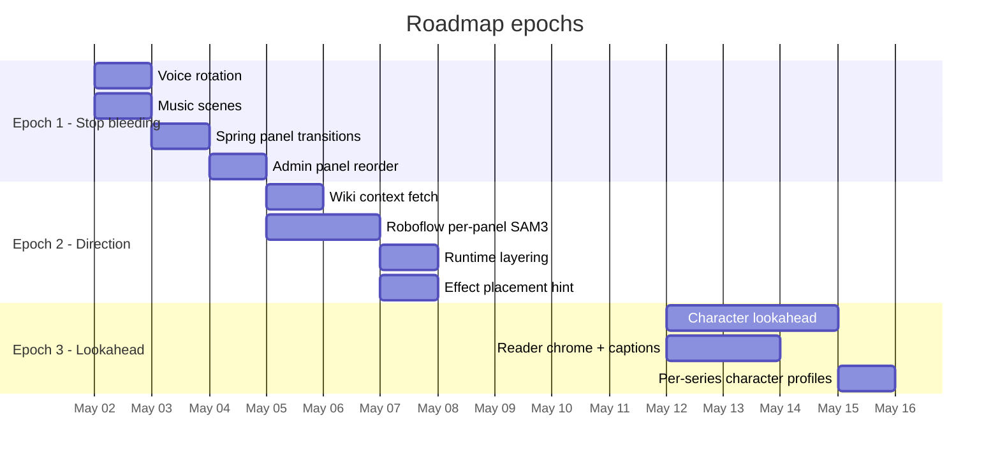

# Roadmap — comic reader north star

This is the entry point for "where we're going and how we get there."
Everything else in `specs/` is supporting detail. Open this first.

---

## What this app is, in one sentence

A kid-first interactive comic reader where every panel is a directed
mini-scene: the page art layers behind particle effects, characters
sit above those effects, dialogue is voiced in the right character
voice with karaoke-synced highlighting, and a soundtrack flows
continuously beneath it all.

## Where we are today (2026-05-02)

| Capability | State | Notes |
|---|---|---|
| Bubble detection (Roboflow) | live | Per-page bbox detection. |
| Panel detection (Roboflow + Gemini) | live | Roboflow returns panel rects; Gemini orders + tags them. |
| Per-panel direction (effect + audio tags) | live | `panels` table populated for tmnt-mmpr-iii issues. |
| Speaker ID per bubble (Gemini) | live | Per-page guess; mangles on non-main characters. |
| Voice cloning (ElevenLabs IVC) | live | 30-slot Creator cap; one-off characters burn slots. |
| Audio gen + karaoke timestamps | live | mp3 + word alignment, layered playback. |
| Reader (zen + panel-by-panel) | live | Panel-view mode persists across pages (just shipped). |
| Spring panel transitions | live | rAF spring physics (stiffness=170, damping=26). Shipped in PR #20. |
| Particle effects on panels | live | Render *on top of* the page — occludes characters/bubbles. |
| Music scenes | live | `music_scenes` table + `consolidate-music-scenes` backfill. Runtime uses `scene_id` for continuity. Shipped in PR #20. |
| Foreground / background separation | live | SVG clip-path layering: bg → effects → fg. Uses SAM3 polygons from `panels.foreground_polygons`. Shipped in PR #23. |
| Wiki context fetch at ingest | live | `fetch-wiki-context` script uses MediaWiki API for Summary + Appearances. Stores in `issues.wiki_summary` / `wiki_appearances`. Shipped in PR #22. |
| Character lookahead (face cluster + identify) | absent | |
| Voice rotation (IVC archive/restore) | live | Pipeline wiring (checkout step 8.5, archive step 12.5). Fidelity test still open. Shipped in PR #20. |
| Admin: bubble↔panel reassign | live | `PanelsReviewClient.tsx`. |
| Admin: panel reorder | live | Drag-to-reorder via `@dnd-kit/sortable`. Sets `source = "manual"`. Shipped in PR #19. |

## North star — what "done enough" looks like

A picture of the end state, not feature-by-feature:

1. **Add a new book in a single afternoon.** Drop pages → ingest →
   review takes <30 min of human time per issue. Voices for one-off
   characters are picked automatically from the ElevenLabs library;
   main-cast voices come from clips you've already curated.
2. **Reading a panel feels directed.** Particles flow *behind*
   characters. Music plays as a single bed under a scene, not
   restarting every tap. Transitions between panels are spring-eased,
   not abrupt.
3. **The data model is honest about what we don't know.** Every
   inference (speaker, mood, scene boundary, effect placement) is
   editable in the admin UI. The runtime trusts the data; humans fix
   bad data.
4. **Voice quota stops being a daily problem.** A new universe (DC ×
   Sonic, etc.) doesn't require upgrading to Pro — finished books
   get their voices archived; new books "check out" slots from the
   Creator cap.
5. **Adding a feature doesn't break the last one.** Each system piece
   has a clear contract with its neighbors. New ideas land in the
   right layer, not as Reader patches.

## How the system fits together (end state)

## Workstreams

Each is its own roadmap doc. Pick them up in order; later ones depend
on earlier ones' data shapes.

| # | Workstream | Spec | Rough size | Depends on |
|---|---|---|---|---|
| 1 | Voice rotation (IVC archive/restore) | [04-voice-rotation.md](04-voice-rotation.md) | 1 day | — |
| 2 | Wiki context fetch | [02-ingest-pipeline.md#wiki](02-ingest-pipeline.md#wiki-context-fetch) | ½ day | — |
| 3 | Combined Roboflow workflow per-panel | [02-ingest-pipeline.md#segmentation](02-ingest-pipeline.md#per-panel-segmentation) | ½ day Roboflow + ½ day plumbing | — |
| 4 | Foreground/background runtime layering | [03-reader-experience.md#layering](03-reader-experience.md#layered-render) | 1 day | (3) |
| 5 | Effect direction by Gemini (placement) | [03-reader-experience.md#effects](03-reader-experience.md#effect-placement) | ½ day | (3) |
| 6 | Character lookahead (cluster + identify) | [02-ingest-pipeline.md#lookahead](02-ingest-pipeline.md#character-lookahead) | 2 days | (2)(3) |
| 7 | Music scenes | [music-scenes.md](../features/music-scenes.md) | 1 day | — |
| 8 | Panel-to-panel transitions (spring) | [03-reader-experience.md#transitions](03-reader-experience.md#transitions) | ¼ day | — |
| 9 | Reader chrome + always-on captions | [03-reader-experience.md#chrome](03-reader-experience.md#chrome-and-captions) | 1.5 days | — |
| 10 | Admin: panel reorder | [05-admin-tooling.md#panel-reorder](05-admin-tooling.md#panel-reorder) | ½ day | — |

## Suggested phasing

Three "epochs," each landing visible value. Inside each epoch the
items are mostly parallelizable.

The dates are illustrative — what matters is the dependency order.

### Epoch 1 — Stop the bleeding

Items the user has been hand-routing around. Land these so the
existing tmnt-mmpr-iii experience matches what the user already
described as "should be." None require pipeline re-runs except music
scenes (which has a backfill script).

### Epoch 2 — Direction (the layered look)

The combined Roboflow workflow already exists at
`https://serverless.roboflow.com/fresh-space/workflows/comic-page-analyzer-1777506243433`
and produces clean SAM3 cutouts. Switching it from per-page to
per-panel + plumbing the polygons into the runtime is what unlocks
the "particles between bg and characters" look.

Action lines / energy / portals / laser detection via separate
Roboflow rapid models was tried and **doesn't work** in the rapid
model. The plan for those is: Gemini decides *what* effect goes
where (region hint), runtime renders it inside the panel bbox with
fg/bg layering doing the heavy lifting visually.

### Epoch 3 — Lookahead

The character-identification rework. Lands after the segmentation
step is producing face polygons (Epoch 2's side benefit) so we don't
need a separate face detector. Pairs with the per-series character
profile schema work.

## Decisions still open

Tracking here to keep them out of the per-spec docs. Each is blocking
or shaping a workstream.

- **IVC recreation fidelity test.** [04-voice-rotation.md] has the
  test recipe; the user provided `kaQG4rvOTzT2F2yIXtSN` as a safe-to-
  break IVC for the experiment. Outcome decides whether main-cast
  voices stay live forever or get rotated like everyone else.
- **Per-panel SAM3 vs per-page SAM3.** The current workflow runs
  SAM3 once per page; Roboflow rep suggested per-panel for cleaner
  masks. Unanswered: does per-panel cost more credits / does
  bbox-cropping the input degrade SAM3? Worth a 30-min Roboflow
  console test.
- **Tighter panel crops à la Kindle.** Kindle crops exactly to panel
  bbox and accepts that bubbles can clip out. We pad. Decision needs
  the user's call on aesthetic vs. completeness.
- **One pgvector table or none.** Pushed off in
  [voice-cloning-and-ingest-lookahead.md] until a kid-facing "Ask"
  feature exists. Keep deferred.

## How to use this folder

- **Starting a new feature?** Find it in the workstreams table.
  Read its linked spec section. If it's not listed, decide whether
  it's a whole new workstream (add to this overview) or fits inside
  one (extend the existing spec).
- **Picking up after a context break?** Re-read this file's "Where
  we are today" table; it gets updated as features land.
- **Got a new idea?** Drop a one-liner under "Decisions still open"
  if it's an unresolved question, or under the right workstream's
  spec if it's a concrete proposal.

## Related (older) research

The pre-roadmap research lives under `specs/research/`. These are
still authoritative on their topics; the roadmap docs reference them
where relevant rather than duplicating.

- [voice-cloning-and-ingest-lookahead.md](../research/voice-cloning-and-ingest-lookahead.md) — original analysis
- [wiki-api/](../research/wiki-api/) — MediaWiki API endpoint patterns
- [features/music-scenes.md](../features/music-scenes.md) — music run grouping
- [features/segmentation-layering.md](../features/segmentation-layering.md) — earlier draft of layering
- [features/reader-chrome-redesign.md](../features/reader-chrome-redesign.md) — Kindle-inspired chrome
