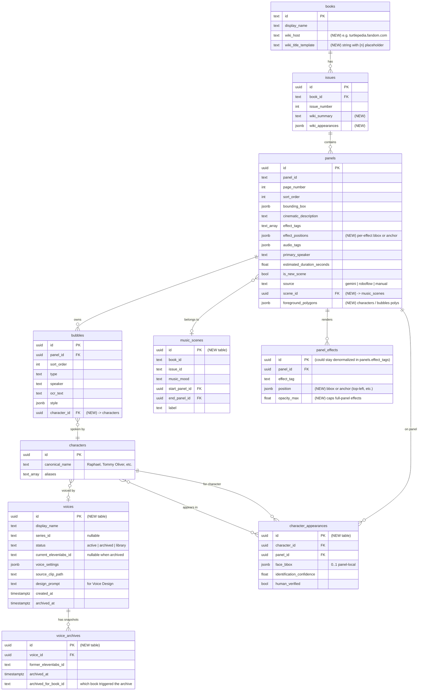

# Data model — end-state schema

The DB is the canonical source of truth. Every inference (speaker,
mood, scene boundary, effect placement) is editable; the runtime
trusts what it reads. This doc describes the end-state shape, not
just what's there today.

> **New fields/tables** below are flagged with `(NEW)`. Existing fields
> with no flag are already in production.

---

## Schema overview



This is the *end-state* picture. Some lines (like `panel_effects` as
its own table) are deferrable — for now per-panel effect data lives
in `panels.effect_tags` and `panels.effect_positions`. The diagram is
to make the relationships legible, not to dictate normalization.

---

## Per-table notes

### `voices` (NEW)

Decouples ElevenLabs voice IDs from our internal character-to-voice
mapping. The whole archive/restore design hinges on this table —
characters reference `voices.id`, and the EL id rotates underneath.

Detail in [04-voice-rotation.md](04-voice-rotation.md).

### `voice_archives` (NEW)

Append-only log of every IVC we've ever created and deleted. Useful
for debugging ("which EL id did this audio come from?") and for
re-tracing if we ever need to verify timbre across recreations.

### `panels.foreground_polygons` (NEW)

```jsonc
{
  "characters": [
    [[0.12, 0.30], [0.18, 0.32], …]   // polygon in panel-local 0..1
  ],
  "bubbles": [
    [[0.40, 0.10], [0.55, 0.10], …]
  ]
}
```

Stored normalized to the panel rect. Render-time clip-paths build
from these. If null on a panel, runtime falls back to "particles on
top of everything" (current behavior).

Output of the combined Roboflow workflow's SAM3 step. See
[02-ingest-pipeline.md#per-panel-segmentation](02-ingest-pipeline.md#per-panel-segmentation).

### `panels.effect_positions` (NEW)

```jsonc
{
  "action_lines": { "anchor": "top-left" },
  "smoke":        { "bbox": [0.0, 0.55, 1.0, 0.45] },
  "energy":       { "anchor": "center" }
}
```

One entry per active `effect_tag`. Either an `anchor` enum
(`top-left | top-right | bottom-left | bottom-right | center |
full-panel`) or a `bbox` (panel-local 0..1). Gemini fills these at
ingest time; humans can override in the admin UI.

### `panels.scene_id` (NEW)

FK into `music_scenes`. Set by the `consolidate-music-scenes` ingest
step. Nullable on legacy panels for graceful runtime degradation.

### `music_scenes` (NEW)

One row per continuous music run. Range expressed as
`(start_panel_id, end_panel_id)` so the runtime can answer "is panel
P in scene S?" via FK without a scan.

Detail in [features/music-scenes.md](../features/music-scenes.md).

### `character_appearances` (NEW)

Denormalized "this character appears on this panel at this face
position" — populated by the lookahead step. Drives:

- Speaker ID by geometry (closest face to a bubble's tail).
- Headshot grid in the character registry.
- "Who's in this issue?" queries for the wiki/voice-sourcing steps.

`identification_confidence` tracks how sure the lookahead step was;
`human_verified` flips to true when an admin confirms in the review
UI.

### `bubbles.character_id` (NEW)

Stable FK replacing the freeform `bubbles.speaker` text field.
`speaker` stays as a denormalized human-readable string for legacy
code; `character_id` becomes the source of truth post-lookahead.

### `books.wiki_host` + `books.wiki_title_template` (NEW)

Per-book config so the wiki ingest step can build the right URL.
Examples:

```
tmnt-mmpr-iii: {
  wiki_host: 'turtlepedia.fandom.com',
  wiki_title_template: 'Mighty_Morphin_Power_Rangers/Teenage_Mutant_Ninja_Turtles_Issue_{n}'
}
```

### `issues.wiki_summary` + `issues.wiki_appearances` (NEW)

Cached output of the wiki fetch step. `wiki_appearances` is the
parsed character list used as context for both Gemini speaker calls
and the lookahead identification step.

---

## What stays denormalized

Some fields look like they want their own tables but don't earn it
yet:

- `panels.effect_tags` — keep as text array. Per-effect detail goes
  in `effect_positions` JSON next to it.
- `panels.audio_tags` — keep as JSON. Used together as a unit, never
  queried independently.
- `bubbles.style` — keep as JSON. Pure render data, no relational
  use.

If we need to query "every panel using effect X" by index, then
promote.

---

## Migration notes

The `(NEW)` items represent ~5 small migrations:

1. `voices` + `voice_archives` tables.
2. `panels.scene_id` + `music_scenes` table.
3. `panels.foreground_polygons` + `panels.effect_positions` columns.
4. `character_appearances` table + `bubbles.character_id` column.
5. `books.wiki_host`, `books.wiki_title_template`, `issues.wiki_summary`,
   `issues.wiki_appearances`.

Each migration is independent — they don't have to land together.
Pair each with the workstream that needs it (per the overview's
phasing table).
