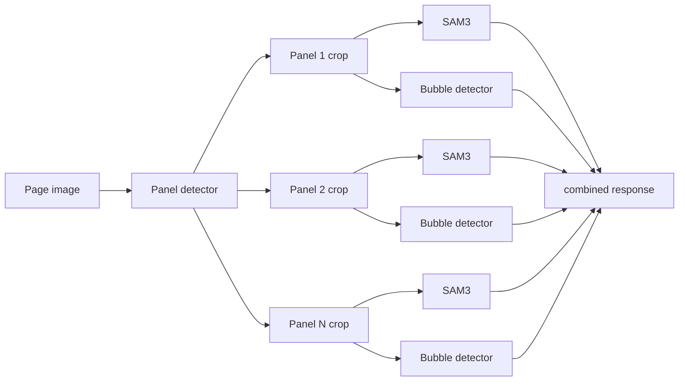
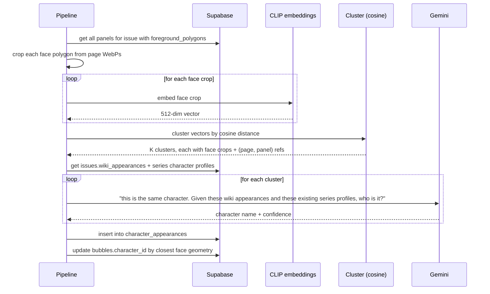
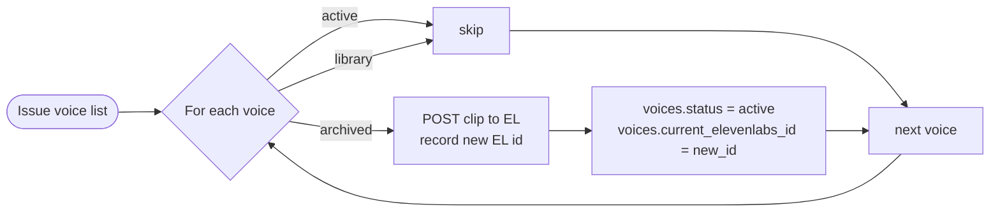

# Ingest pipeline — end state

The shape of the ingest pipeline once every workstream lands. New
steps are flagged `(NEW)`; existing steps from `CLAUDE.md` keep their
names.

---

## End-state pipeline

```mermaid
flowchart TB
    Start([pnpm ingest --book X --issue N]) --> V[1. validate-inputs]
    V --> M[2. generate-pages-metadata]
    M --> W[3. convert-pages-to-webp]
    W --> Wiki[3.5 fetch-wiki-context NEW]
    Wiki --> RF[4. roboflow-page-analyze NEW<br/>panels + bubbles + SAM3 polys]
    RF --> Geo[4.1 reading-order-canonicalize NEW<br/>row-band sort + persist sort_order]
    Geo --> Mask[4.2 extract-foreground-masks NEW<br/>polys to panel-local 0..1]
    Mask --> OCR[4.3 ocr-bubbles<br/>existing get-context bubble half]
    OCR --> Look[4.4 character-lookahead NEW<br/>cluster faces + identify]
    Look --> Direct[5. panel-director<br/>effect tags + audio tags + positions]
    Direct --> SortBub[6. sort-bubbles-gemini]
    SortBub --> Style[7. add-bubble-styles]
    Style --> Music[7.5 consolidate-music-scenes NEW]
    Music --> Voice[8. find-voice-sources<br/>library-first NEW]
    Voice --> VR[8.5 voice-rotation-checkout NEW]
    VR --> Models[9. generate-voice-models]
    Models --> Audio[10. generate-audio]
    Audio --> Public[11. copy-to-public]
    Public --> Manifest[12. generate-manifest]
    Manifest --> Archive[12.5 voice-rotation-archive NEW]
    Archive --> Done([Done])

    style Wiki fill:#fff3cd
    style RF fill:#fff3cd
    style Geo fill:#fff3cd
    style Mask fill:#fff3cd
    style Look fill:#fff3cd
    style Music fill:#fff3cd
    style VR fill:#fff3cd
    style Archive fill:#fff3cd
```



Yellow nodes are new. The original 13 steps in `CLAUDE.md` stay
mostly intact; insertions cluster around the data-collection stage
(steps 3.5–4.4) and the voice-management stage (8.5 + 12.5).

---

## Per-step detail (new and changed steps only)

### 3.5 `fetch-wiki-context` (NEW)

**Purpose**: Pull the issue's Summary + Appearances list from the
fandom wiki so downstream Gemini calls have grounded context.

**Input**: `books.wiki_host` + `books.wiki_title_template` from DB,
issue number.

**Output**:
- `issues.wiki_summary` (text)
- `issues.wiki_appearances` (jsonb — list of character names with
  any links/aliases extracted from the Appearances section)

**Algorithm**:

```
url = `https://${wiki_host}/api.php?action=parse&page=${title}&format=json&prop=text|sections`
response = GET url
sections = response.parse.sections   // index of named sections
summaryIdx = sections.find(s => s.line === "Summary")
appearancesIdx = sections.find(s => s.line === "Appearances")
fetch each section's text via prop=text&section=<idx>
strip HTML, persist to issues row
```

**Failure mode**: Wiki has no page, or no Summary/Appearances section.
Step returns gracefully with `null` fields — does not abort ingest.
Downstream steps fall back to current "no wiki context" behavior.

**Detail**: see
[research/voice-cloning-and-ingest-lookahead.md#wiki-api-ingestion](../research/voice-cloning-and-ingest-lookahead.md).

### 4 `roboflow-page-analyze` (NEW, replaces existing get-context Roboflow call)

**Purpose**: Single Roboflow workflow call returning panel bboxes,
bubble bboxes, and SAM3 segmentation polygons.

**Endpoint** (production for ingest):
`https://serverless.roboflow.com/infer/workflows/fresh-space/comic-page-analyzer-v3-full-page-sam3`

**Workflow ID**: `NyslOhzdmti28rpDD10M`
**Slug**: `comic-page-analyzer-v3-full-page-sam3`

**Status**: Built 2026-05-01 after v2 hit a Roboflow bug. v3 runs
SAM3 once on the full page (rather than per panel). Validated end-to-end
on `tmnt-mmpr-iii/issue-1` (26/26 pages, ~6s each, sidecars at
`assets/comics/.../data/sam3/page-NN.json`).

**Why v3 instead of v2**: We initially built a per-panel-SAM3 workflow
(`comic-page-analyzer-v2-per-panel-sam3`, ID `bIENpbdiWqay9ZTCrL1y`)
because Roboflow's rep recommended per-panel for tighter masks. It
worked on a smoke test of two pages but failed on 12 of 26 pages with
a runtime error from the `dynamic_crop@v1` block: *"Step panel_crops
did not produce required outputs. Expected: {'predictions', 'crops'}.
Got: {'crops'}."* Reproducible in isolation (just panel_model →
dynamic_crop, no SAM3) — purely a dynamic_crop block bug. Bug filed
to Roboflow via `meta_feedback_send` 2026-05-01. When fixed, the env
var `ROBOFLOW_SAM3_WORKFLOW_URL` can be flipped back to v2 with no
code changes needed in the parser (see notes below).

**Tradeoff**: full-page SAM3 produces slightly looser masks than
per-panel would, per the Roboflow rep. In practice the masks have
been good enough for the layered-render use case. Polygon coords come
back in page-space; `extract-foreground-masks` (step 4.2) handles the
panel-local conversion using the panel bboxes from the same response.

The earlier full-page workflow `comic-page-analyzer-1777506243433`
remains untouched as a separate prod-safe artifact and is *not* the
endpoint we wire ingest to.

**Pipeline shape inside the v3 workflow** (current):

```
input image
  ├─→ panel_model (find-comic-panel-v1/1 @ 0.4)
  ├─→ bubble_model (find-speech-bubbles-fmu3y/4 @ 0.3)
  └─→ sam3@v3 (full page)
       classes: comic character | person | face | head | speech bubble
       confidence: 0.4
       output_format: polygons
```

**Pipeline shape v2 would have used (currently broken upstream)**:

```
input image
  ├─→ panel_model
  ├─→ bubble_model
  └─→ dynamic_crop ← BUG: doesn't always emit `predictions` output
        └─→ sam3@v3 per crop
```

**Per-panel segmentation flow**:



**v3 response shape** (actual, ingested into `data/sam3/page-NN.json`):

```jsonc
{
  "outputs": [{
    "panel_predictions": {
      "image": { "width": 1988, "height": 3057 },
      "predictions": [
        { "x", "y", "width", "height", "confidence",
          "class": "comic panel", "detection_id" }
      ]
    },
    "bubble_predictions": { /* same shape, class: "speech bubble" */ },
    "segmentation_predictions": {
      "image": { "width": 1988, "height": 3057 },
      "predictions": [
        {
          "class": "comic character" | "person" | "face" | "head" | "speech bubble",
          "confidence": 0.96,
          "points": [{ "x": 1489, "y": 2692 }, …],   // page-space pixels
          "detection_id", "parent_id"
        }
      ]
    }
  }]
}
```

After our parser strips visualizations and flattens, the persisted
sidecar is:

```jsonc
{
  "image": { "width": 1988, "height": 3057 },
  "panel_predictions":        [/* BoxPrediction[] */],
  "bubble_predictions":       [/* BoxPrediction[] */],
  "segmentation_predictions": [/* SegmentationPrediction[] */]
}
```

**Coordinate detail**: All SAM3 polygon coords are in **page-space
pixels** (the full-page input space). Step 4.2 normalizes to
panel-local 0..1 by assigning each polygon to a panel via centroid-in-bbox
and then subtracting the panel bbox origin / dividing by panel dimensions.

**Class assignment in step 4.2**:
- `comic character | person | face | head` → `foreground_polygons.characters` bucket
- `speech bubble` → `foreground_polygons.bubbles` bucket

The runtime renders the page WebP twice with complementary clip-paths
using these polygons (see `03-reader-experience.md`). Bubbles get a
separate exclusion zone so particle effects don't render over the
text.

### 4.1 `reading-order-canonicalize` (NEW)

**Purpose**: Persist row-band-sorted reading order in `panels.sort_order`
so the runtime doesn't have to re-sort on every page load.

The runtime sort (`src/lib/panel-reading-order.ts`) shipped already
to fix existing books. This step makes the same algorithm canonical
in the DB.

**Algorithm**: identical to the runtime sort. Skips when any panel
on the page has `source = "manual"` (preserves human edits).

### 4.2 `extract-foreground-masks` (NEW)

**Purpose**: Convert the Roboflow per-panel SAM3 polygons into the
shape the runtime layering expects.

**Output**: `panels.foreground_polygons`:

```jsonc
{
  "characters": [[[x,y],…]],   // panel-local 0..1
  "bubbles":    [[[x,y],…]]
}
```

**Algorithm**:
1. For each panel index *i*, take
   `panel_segmentation_predictions[i].predictions` (page-space
   coords from `dynamic_crop`) and the matching panel bbox from
   `panel_predictions.predictions[i]`.
2. Filter polygons to character/face/head/person classes (foreground)
   and bubble classes (separate set; runtime treats them as a different
   exclusion zone for particles).
3. Merge overlapping same-class polygons (union).
4. Convert to panel-local 0..1: `(point.x - panel.bbox.x) / panel.bbox.w`,
   same for y/h.
5. Simplify via Ramer–Douglas–Peucker to ~30 vertices per shape so
   the persisted clip-path string stays small.

Detail: [features/segmentation-layering.md](../features/segmentation-layering.md).

### 4.4 `character-lookahead` (NEW)

**Purpose**: Identify every character that appears in the issue, by
clustering face crops and asking Gemini to name each cluster using
the wiki appearances list as context.



**Inputs**: panel face polygons (from 4.2), wiki appearances (from
3.5), existing series character profiles.

**Outputs**:
- Rows in `character_appearances` `(character_id, panel_id, face_bbox,
  identification_confidence)`.
- `bubbles.character_id` populated by geometry: closest face to the
  bubble's tail wins.

**Why this changes everything**: speaker ID stops being "guess from
the page image" and becomes "find the closest character_appearance
to this bubble's tail." Geometry, not vision. Gemini's hallucination
failure mode disappears for non-main characters.

Detail: [research/voice-cloning-and-ingest-lookahead.md#highest-leverage-face-detection](../research/voice-cloning-and-ingest-lookahead.md).

### 5 `panel-director` (CHANGED — adds effect placement)

The existing step that emits `effect_tags` + `audio_tags` per panel.
**Change**: also emit `effect_positions`:

```jsonc
{
  "effect_positions": {
    "action_lines": { "anchor": "top-left" },
    "smoke":        { "bbox": [0.0, 0.55, 1.0, 0.45] }
  }
}
```

Per the user's findings: Roboflow rapid models do *not* reliably
detect action lines / energy / portals / lasers. So Gemini decides
both *what* effect and *where* — even if the "where" is just an
anchor enum.

The runtime layering does the heavy visual lifting (effects render
between bg and characters/bubbles), so even loose placement looks
right.

### 7.5 `consolidate-music-scenes` (NEW)

**Purpose**: Group runs of panels with the same/similar
`music_mood` into a single `music_scenes` row so the runtime music
bed plays continuously instead of restarting each panel.

Detail: [features/music-scenes.md](../features/music-scenes.md).

### 8 `find-voice-sources` (CHANGED — library-first)

The existing step that picks ElevenLabs voices for each character.
**Change**: prefer ElevenLabs library voices for one-off characters
(<3 lines and not in series character profiles). Library voices
don't consume IVC slots.

Detail: [04-voice-rotation.md#one-off-characters](04-voice-rotation.md).

### 8.5 `voice-rotation-checkout` (NEW)

**Purpose**: Before generating audio, ensure every voice the issue
needs is currently `status = 'active'` in our `voices` table. If
archived, restore it (re-uploads the source clip to ElevenLabs,
records new EL id).



### 12.5 `voice-rotation-archive` (NEW)

**Purpose**: After successful audio generation + manifest publish,
archive any voices that are *not* in the long-term keep list (main
casts, library voices). Frees IVC slots for the next book's ingest.

Behaviour driven by per-book + per-character flags; defaults to
"archive after publish unless flagged keep-active." Detail in
[04-voice-rotation.md#archive-and-restore-flow](04-voice-rotation.md).

---

## Migration plan

The pipeline doesn't have to switch to the end-state in one go.
Order the new steps to keep the existing flow working:

1. **Insert 3.5 + 4 + 4.1 + 4.2** as additive steps. Existing
   speaker-ID still uses Gemini's per-page guess; lookahead runs
   alongside but its output isn't trusted yet (writes to
   `character_appearances` but `bubbles.character_id` stays null).
2. **Run on tmnt-mmpr-iii** (rebuild ingest output). Compare
   lookahead's character labels against the existing speaker text.
   Audit accuracy.
3. **Flip the read path**: speaker resolution starts using
   `bubbles.character_id` when populated, falling back to the old
   text field when not.
4. **Insert 7.5 + 8.5 + 12.5** for music + voice rotation. These
   are pure data-side changes, runtime contract unchanged.
5. **Insert 4.4 lookahead's geometric speaker assignment** as a
   panel-director input (so panel-director knows the face positions
   and primary speaker without guessing).

Each migration step lands with a backfill script for existing
content under `assets/comics/tmnt-mmpr-iii/`.

---

## Cost shape

Roughly the per-issue cost-of-ingest at end state:

| Step | Cost driver | Order of magnitude |
|---|---|---|
| Roboflow page analysis | per-page API call | 25 calls × pennies |
| Gemini speaker/effect/audio direction | per-page calls | 25 × low cents |
| Character lookahead | embedding + 1 Gemini per cluster | K=~10 calls + CLIP local |
| Voice generation | per-bubble TTS | hundreds of TTS units |
| Voice models | per-IVC creation | ≤ 30 IVC creates |

Lookahead's K = O(distinct characters) keeps it flat as books get
longer. The cost line that grows with content is TTS, which is the
expected one.
