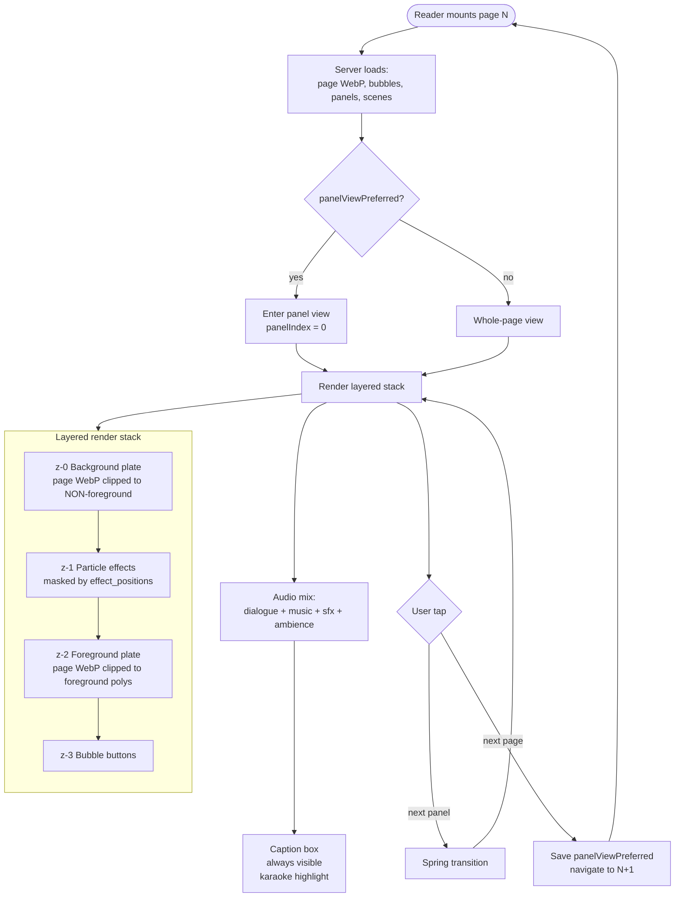
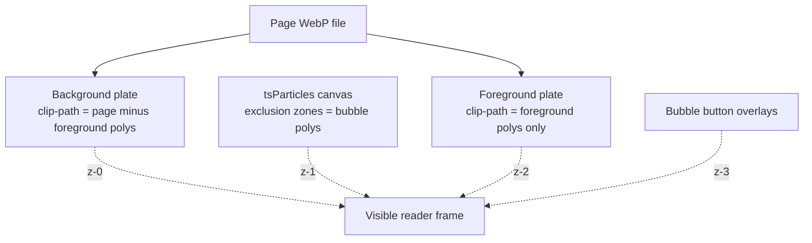
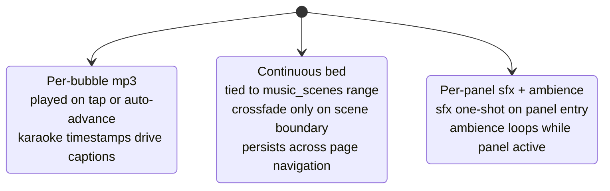

# Reader experience — end state

What the reader looks and feels like when all the workstreams have
landed: how panels render, how transitions feel, where chrome lives,
and how the always-on caption box solves the karaoke-in-tiny-bubble
problem.

---

## The runtime, end to end



---

## Layered render

The visual fix for "particle effects swallow the page" (item #4 in
the 2026-04-30 feedback). Page art is rendered *twice* with
complementary clip-paths so particles end up between the background
and the foreground without any image-baking at ingest time.



### What renders where

| Layer | Source | Notes |
|---|---|---|
| z-0 Background plate | `<Image>` with `clip-path: polygon(...)` *outside* foreground | Reuses cached page WebP |
| z-1 Particle effects | `tsParticles` / Paper Shaders | Each effect bounded by `effect_positions[tag]` (bbox or anchor) |
| z-2 Foreground plate | Same `<Image>` clipped *inside* foreground polygons | Browser deduplicates the bitmap |
| z-3 Bubble buttons | Existing absolute-positioned buttons | Tap targets — visually unchanged |

When `panels.foreground_polygons` is null (legacy panels not yet
backfilled), runtime falls back to the current "particles on top"
render so the reader still works.

Detail: [features/segmentation-layering.md](../features/segmentation-layering.md).

### Effect placement

Per-effect position from `panels.effect_positions`. The Roboflow
rapid model **failed** at action-line / energy / portal / laser
detection (per the user's testing), so we don't try to detect those
shapes — Gemini picks the position at ingest time as either an
anchor enum (`top-left | top-right | bottom-left | bottom-right |
center | full-panel`) or a bbox.

Effects use the position the way you'd expect:

- **Anchor**: effect renders within a default-sized region anchored
  to that corner/center.
- **Bbox**: effect renders inside the bbox.

Examples:

```ts
// "lines in the upper-left where the art has lines"
"action_lines": { anchor: "top-left" }

// "smoke flowing across the bottom half"
"smoke": { bbox: [0.0, 0.55, 1.0, 0.45] }
```

The visual quality lift comes from the layering (effects behind the
foreground), not from precise placement. Gemini gets the placement
roughly right; the layering makes it forgiving.

---

## Transitions

Today: `transition: transform 120ms ease-out`. Abrupt and linear.

End state: spring easing on panel-to-panel transforms. Implementation
is small — replace the transition string with a spring curve via
hand-rolled `requestAnimationFrame` (~30 lines, no new dependency)
or Framer Motion if we want the broader animation toolkit.

```ts
// approximate spring curve
function springStep(current, target, velocity, stiffness=170, damping=26) {
  const force = -stiffness * (current - target);
  const drag = -damping * velocity;
  velocity += (force + drag) * dt;
  current += velocity * dt;
  return [current, velocity];
}
```

Motion-respecting fallback already exists via
`usePrefersReducedMotion()` — if the user has reduced motion,
transitions stay on the simple ease curve.

Cost: ~¼ day. Lives in `src/components/zen-comic-reader/PanelView.tsx`
and `PanelView.transforms.ts`.

---

## Chrome and captions

The user's two main asks here:

1. The bottom control bar feels cluttered. Pull cues from Kindle's
   layout (auto-hiding chrome, settings tucked behind a single sheet).
2. **Keep the speaker / text-highlight section visible at all times**,
   captions-style. Bubble-internal karaoke is a future "magic" feature;
   until then, captions are how kids follow along with which word is
   playing right now.

### Layout

```
┌─────────────────────────────────────────┐
│ Top bar (auto-hide after 3s idle)       │
│  ← back   ☰ pages   ⚙ settings   Aa     │
├─────────────────────────────────────────┤
│                                         │
│           Comic page / panel            │
│                                         │
├─────────────────────────────────────────┤
│ Captions (ALWAYS visible)               │
│   RAPHAEL                               │
│   "I just need to focus, here we go!"   │
│                       ^ active word     │
├─────────────────────────────────────────┤
│ Progress bar (always visible)           │
└─────────────────────────────────────────┘
```

The captions section is non-negotiable — explicit feedback. It stays
present even when the rest of the chrome auto-hides. The progress
bar is a thin always-on element below it.

### Settings sheet — three sections

Reorganized from today's flat list:

1. **Audio**: reading speed slider, volume per layer (dialogue /
   music / sfx / ambience), reset to defaults.
2. **Reading**: auto-advance on/off, default to panel view, motion
   intensity, reduced-motion respect.
3. **About**: "Available offline" indicator, version.

### "Aa" view sheet

Smaller contextual sheet in the top-right, mirrors a couple of
Kindle conventions:

- **View**: Whole page / Panel by panel
- **Motion**: Off / Reduced / Full

Same state as the main settings sheet — this is just a one-tap
shortcut for the most-changed controls.

Detail: [features/reader-chrome-redesign.md](../features/reader-chrome-redesign.md).

### Bubble vs caption highlight — coexistence

Today the bubble outlines highlight when active and the karaoke
word-highlight lives inside `SpeechBox`. End state:

- Active bubble: kept (cyan border) — visual anchor for which bubble
  is playing.
- Captions: always visible, karaoke-highlights the active word, in a
  larger easier-to-read font than the bubble.
- "Magic" in-bubble karaoke (highlighting words inside the actual
  speech bubble): a future workstream that requires per-word bbox
  detection inside the bubble. Not blocking — captions cover the
  reading-along need.

---

## Audio model (end state)

Three independent layers with different lifecycles:



Music is the load-bearing change: today it lives inside
`PanelAudioLayer` which mounts inside the page route, so it dies on
every page navigation. End state hoists the music `<audio>` element
to a layout-level provider (`MotionAudioProvider` in
`src/app/layout.tsx`) so playback survives page nav. Continues
playing as long as the next page is in the same `scene_id`.

Detail: [features/music-scenes.md](../features/music-scenes.md).

---

## What's already shipped vs. what's left

### Shipped (live in the reader today)

- Zen reader with docked HUD, swipe page nav, double-tap toggle.
- Panel-by-panel mode with auto-play.
- Karaoke word highlight (in caption box; bubble-internal pending).
- Per-bubble dialogue + per-panel sfx/ambience/music.
- Pinch-to-zoom.
- Volume sliders + reading-speed slider in settings.
- Service-worker offline reading.
- Panel reading-order runtime sort + admin manual override.
- `panelViewPreferred` persists across page transitions (just
  shipped).

### Remaining for end state

- Layered render stack (depends on Roboflow per-panel SAM3 +
  `extract-foreground-masks`).
- Spring panel transitions (¼ day).
- Music scenes — runtime continuity across pages (depends on
  `consolidate-music-scenes` + layout-level provider).
- Chrome redesign + always-on captions (1.5 days).
- Bubble-internal karaoke highlight (future workstream — needs
  per-word bbox).
