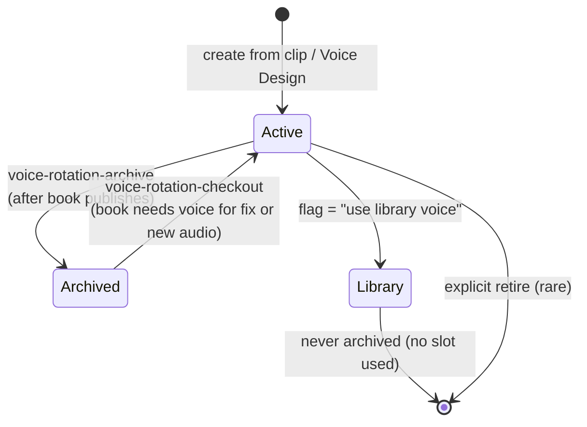
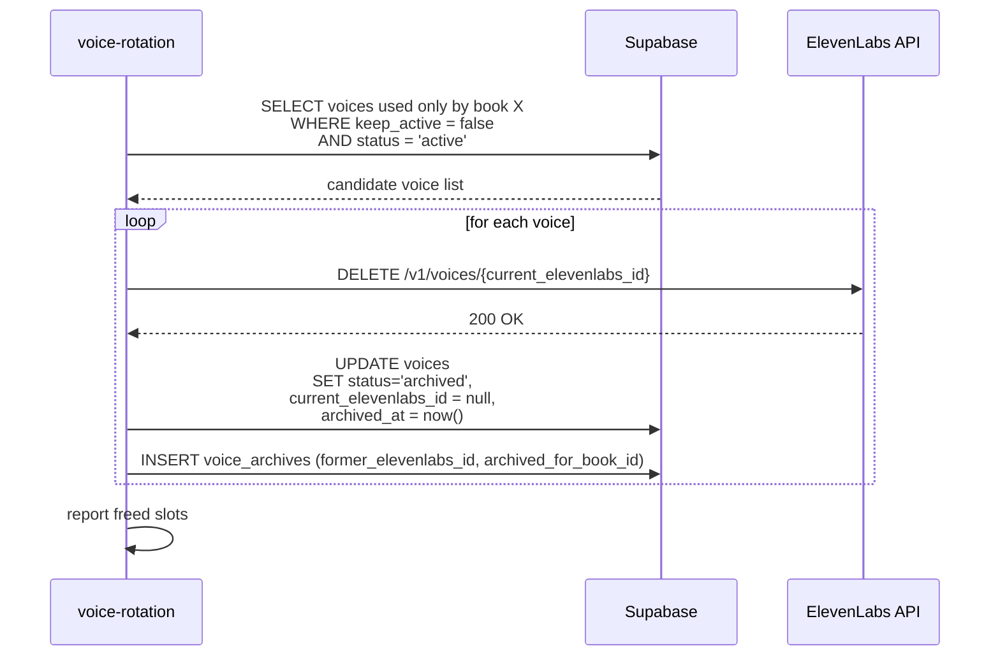
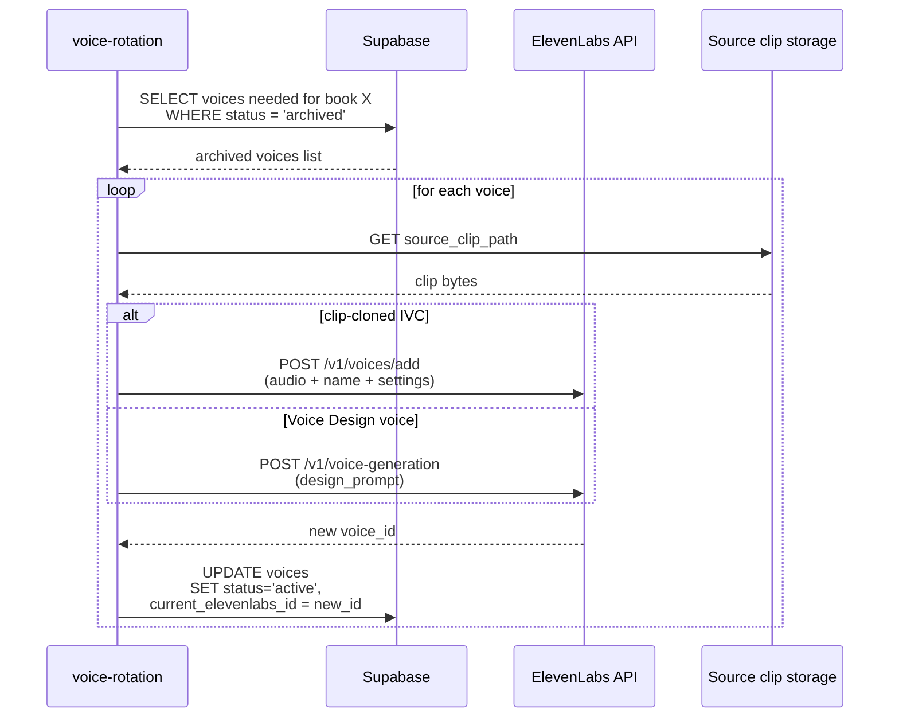
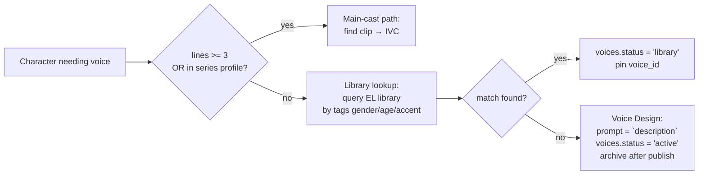

# Voice rotation — IVC archive/restore

The concrete plan for keeping the 30-IVC Creator cap from blocking new
books. Replaces the prior research notes with implementation detail
and a real fidelity test using a safe-to-break voice.

Background context lives in
[research/voice-cloning-and-ingest-lookahead.md](../research/voice-cloning-and-ingest-lookahead.md).
Read this doc for the *plan*; read that one for the *why*.

---

## Goals

1. Keep the active IVC count under 30 indefinitely while ingesting
   any number of new books.
2. Re-create voices on demand without the runtime caring that the
   ElevenLabs ID changed.
3. Don't archive things we'll need again soon (main-cast voices stay
   live).

---

## Lifecycle states



Three persistent states:

- **Active**: voice exists in ElevenLabs, has a `current_elevenlabs_id`,
  consumes a slot.
- **Archived**: deleted from ElevenLabs to free the slot. We retain
  the source clip + settings to recreate.
- **Library**: shared community voice from ElevenLabs. Doesn't count
  against the cap, never archived by us.

---

## Tables

```sql
create table voices (
  id uuid primary key default gen_random_uuid(),
  display_name text not null,
  series_id text,                            -- nullable; library voices may be cross-series
  status text not null
    check (status in ('active','archived','library')),
  current_elevenlabs_id text,                -- null when archived
  voice_settings jsonb,                      -- stability, similarity, style
  source_clip_path text,                     -- storage path to training audio
  design_prompt text,                        -- for Voice Design voices
  keep_active boolean default false,         -- "do not archive on book publish"
  created_at timestamptz default now(),
  archived_at timestamptz
);

-- append-only log of every (re)creation event
create table voice_archives (
  id uuid primary key default gen_random_uuid(),
  voice_id uuid references voices(id) on delete cascade,
  former_elevenlabs_id text,
  archived_at timestamptz default now(),
  archived_for_book_id text                  -- which book triggered the archive
);

-- characters reference voices by our stable id
alter table characters add column voice_id uuid references voices(id);
```

The `keep_active` flag is the simple knob for "this is a main-cast
voice, never archive." The default `false` means everything else
gets rotated.

---

## CLI surface

```
pnpm voice-rotation -- --check                 # report current vs 30
pnpm voice-rotation -- --archive --book X      # archive non-keep-active voices used only by book X
pnpm voice-rotation -- --restore --book X      # ensure all of X's voices are active
pnpm voice-rotation -- --restore-id <voice_id> # one-off restore by internal id
```

These are also called by the ingest pipeline:

- Step 8.5 (`voice-rotation-checkout`) calls `--restore --book X`
  before audio gen.
- Step 12.5 (`voice-rotation-archive`) calls `--archive --book X`
  after manifest publish.

---

## Archive flow



"Used only by book X" means: every character pointing at this voice
appears only in issues of book X. If a voice is shared across books,
we don't archive it — it'll be needed.

---

## Restore flow



The runtime never sees the ID rotation. `castlist.json` is
regenerated at audio-gen time from `voices.current_elevenlabs_id`.

---

## Library voice fallback (one-off characters)

Step 8 (`find-voice-sources`) gets a new branch:



Library matches don't burn slots. Voice Design fallback creates an
IVC slot but it's archived right after the book publishes (no
`keep_active`).

---

## The fidelity test

The whole archive/restore plan rests on one assumption: **a
recreated IVC sounds the same as the original when fed the same
source clip + settings**. If timbre drifts noticeably, we can't
archive main-cast voices and the cap math gets harder.

The user provided a safe-to-break IVC for testing:

```
Voice ID: kaQG4rvOTzT2F2yIXtSN
Description: random generic soldier voice
Notes: nothing to be missed if the test fails
```

### Test recipe

```bash
# 1. Pull the current voice metadata + settings
curl -s -H "xi-api-key: $ELEVENLABS_API_KEY" \
  "https://api.elevenlabs.io/v1/voices/kaQG4rvOTzT2F2yIXtSN" \
  | jq '.' > /tmp/soldier-before.json

# 2. Generate a reference line with the original
curl -s -X POST \
  -H "xi-api-key: $ELEVENLABS_API_KEY" \
  -H "Content-Type: application/json" \
  -d '{"text":"Halt! Identify yourself or face the consequences.",
       "voice_settings":{"stability":0.5,"similarity_boost":0.75}}' \
  "https://api.elevenlabs.io/v1/text-to-speech/kaQG4rvOTzT2F2yIXtSN" \
  > /tmp/soldier-before.mp3

# 3. Pull the source samples used for the IVC
curl -s -H "xi-api-key: $ELEVENLABS_API_KEY" \
  "https://api.elevenlabs.io/v1/voices/kaQG4rvOTzT2F2yIXtSN/samples" \
  > /tmp/soldier-samples.json
# download each sample's audio via /v1/voices/.../samples/.../audio

# 4. Delete the IVC
curl -s -X DELETE -H "xi-api-key: $ELEVENLABS_API_KEY" \
  "https://api.elevenlabs.io/v1/voices/kaQG4rvOTzT2F2yIXtSN"

# 5. Re-create from the saved samples + same settings
curl -s -X POST -H "xi-api-key: $ELEVENLABS_API_KEY" \
  -F "name=Soldier (recreated)" \
  -F "files=@sample1.mp3" -F "files=@sample2.mp3" \
  "https://api.elevenlabs.io/v1/voices/add"
# capture new voice_id from response

# 6. Generate the same line with the recreated IVC
curl -s -X POST \
  -H "xi-api-key: $ELEVENLABS_API_KEY" \
  -H "Content-Type: application/json" \
  -d '{"text":"Halt! Identify yourself or face the consequences.",
       "voice_settings":{"stability":0.5,"similarity_boost":0.75}}' \
  "https://api.elevenlabs.io/v1/text-to-speech/<new_id>" \
  > /tmp/soldier-after.mp3
```

### Evaluating the result

Listen to `before.mp3` vs `after.mp3` back-to-back.

| Outcome | Implication |
|---|---|
| Indistinguishable | Archive everything by default. No timbre risk. |
| Slightly different but same character | Archive secondaries; flag main casts as `keep_active=true` to avoid drift across long-running books. |
| Noticeably different voice | Archive only voices that won't need future audio. Main-cast voices stay live forever; new-book voices archive at end of ingest only if the book is "done." |

The user can do this test in 10 minutes. I can't run the API calls
without the key, but I can ship the script as
`scripts/test-ivc-fidelity.ts` so it's a one-command run.

---

## Phasing

1. **Schema + script**: `voices` + `voice_archives` migrations,
   `voice-rotation` script with `--check / --archive / --restore`.
2. **Backfill**: populate `voices` from existing `castlist.json`
   files. `keep_active = true` for tmnt-mmpr-iii main cast, `false`
   for everyone else.
3. **Wire ingest**: insert step 8.5 + 12.5. Run end-to-end on a
   throwaway book to verify.
4. **Library voice path**: extend `find-voice-sources` with the
   library lookup. Test on a known one-off character.
5. **Fidelity test**: ship `scripts/test-ivc-fidelity.ts` and run on
   `kaQG4rvOTzT2F2yIXtSN`. Decide `keep_active` defaults from the
   result.

Total: ~1 day of work + 10 min of fidelity-test listening. Step 5
gates the default policy but doesn't block the rest from landing —
worst case we set `keep_active = true` more aggressively.
