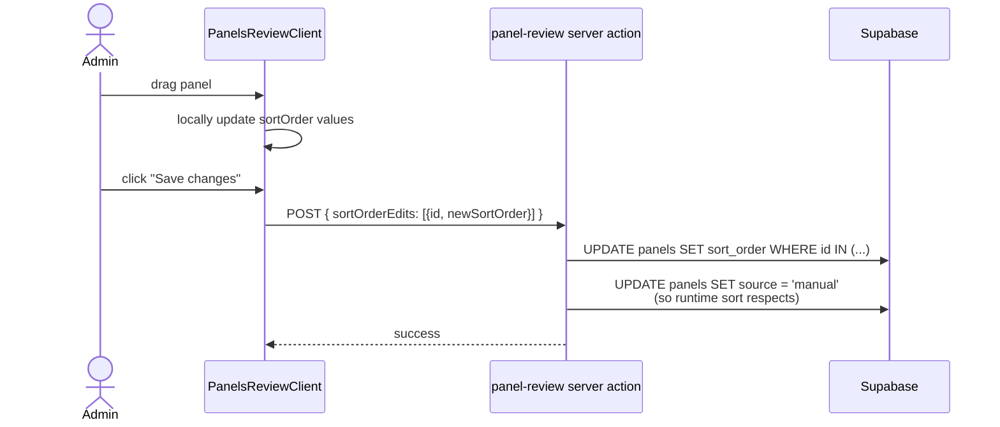
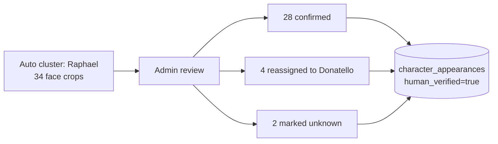
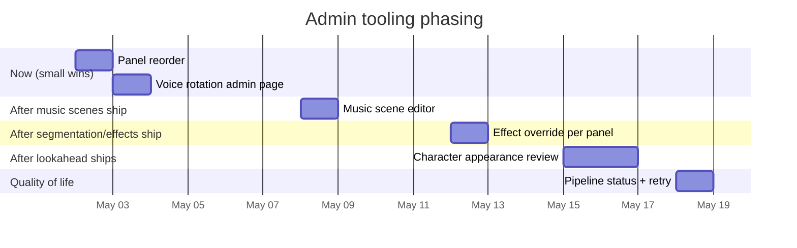

# Admin tooling — gaps and additions

The admin UI is the human-correction surface for everything the
ingest pipeline guesses. As we add new ingest steps (lookahead,
music scenes, segmentation), the admin UI needs matching edit
controls so a human can fix a wrong guess in seconds.

This doc inventories what's there, what's missing, and where new
controls slot in.

---

## What exists today

| Area | Where | Capabilities |
|---|---|---|
| Bubble editor | `/admin/[bookId]/[issueId]/review` | Edit text, speaker, type; resize/move bbox; add/delete; drag to reorder; export `fixes.json`. |
| Panel review | `/admin/[bookId]/[issueId]/review/panels` | Drag panel edges to resize; click bubble to **reassign** to a different panel; effect/audio tag chips per panel; add/delete panels. |
| New-character review | `/admin/[bookId]/[issueId]/review/new-characters` | Confirm new character names, alias to existing. |
| Character casting | `/admin/characters/casting` | Voice clip sourcing flow. |
| Effects preview | `/admin/effects-preview` | Visual gallery of every registered effect (camera-demo style). |
| Audio library | `/admin/audio-library` | Browse + play audio library tracks. |
| New issue upload | `/admin/new-issue` | Drag-drop pages → kicks off ingest. |

User Q&A from the 2026-05-01 roadmap conversation:

> **Do we have the ability to reassign a bubble from one panel to another?**

Yes. `PanelsReviewClient.tsx:187` `reassignBubble(bubbleId, panelId)`,
exposed via two flows:
- Click a panel to select, then click a bubble to add it.
- Click a bubble to open the "reassign to" picker.

> **Are we storing panel order in the DB?**

Yes — `panels.sort_order`. But there's no UI to *edit* it. It's
read-only from the panel review page; gets set by the ingest
pipeline only.

---

## Gaps (in priority order)

### 1. Panel reorder

**Problem**: Panel order is set by Gemini at ingest. Users can't
correct mis-orders without a script + re-ingest. The runtime row-band
sort handles common cases but exotic layouts (overlapping rows,
splash pages with multiple inset panels) still need a manual fix.

**Solution**: Add drag-to-reorder to the panel review page, mirroring
how bubbles are reordered today (`@dnd-kit/sortable` is already a
dep).

**Where it lives**: `PanelsReviewClient.tsx` + a new sortable wrapper
around the panel cards. ~½ day.

**Important**: when a panel is reordered, set `source = "manual"`.
The runtime panel-reading-order sort respects manual panels
(`src/lib/panel-reading-order.ts:18`), so the manual order wins.

### 2. Music scene editor

**Problem**: After `consolidate-music-scenes` runs, panels are
grouped into runs. The grouping is heuristic — sometimes wrong.

**Solution**: Add a "Music scene" column to the panel review UI:

- Default shows the auto-grouped scene name + first panel/last panel
  range.
- Click → menu of:
  - Extend previous scene (merge with N-1)
  - Start new scene here (split before this panel)
  - Merge with next scene (merge with N+1)
  - Change canonical music_mood

Writes to the `music_scenes` table directly. Detail in
[features/music-scenes.md](../features/music-scenes.md).

### 3. Effect override per panel

**Problem**: Gemini picks effect tags + positions. Sometimes wrong
(e.g. pinwheel in center when art has action lines top-left). User
needs to correct without re-running ingest.

**Solution**: Per-panel effect controls:

- List of active `effect_tags` with delete buttons.
- "Add effect" picker.
- Per-effect position editor:
  - Anchor radio (`top-left | top-right | center | …`).
  - Or a draggable bbox overlay on the panel preview.
- Per-effect opacity slider.

Writes to `panels.effect_positions` JSON. Sets `source = "manual"`.

### 4. Voice rotation manual control

**Problem**: The default archive-on-publish behavior might be wrong
for specific voices ("Splinter is in every TMNT book; never
archive").

**Solution**: A simple voices admin page:

- Table of all voices with: name, status (active/archived/library),
  series, current EL id (truncated), `keep_active` toggle.
- Per-row buttons: archive now / restore now / set keep-active.
- Header actions: "Show only active" / "Filter by series."

This is admin housekeeping, not edit-the-content; doesn't need to
be elaborate. Probably 4-6 hours of UI work.

### 5. Character appearance review

**Problem**: After `character-lookahead` lands, every panel has
`character_appearances` rows with face bboxes + identifications.
The lookahead gets things wrong sometimes (mis-cluster, mis-name).

**Solution**: A face-grid view per character — show every face
crop the lookahead assigned to "Raphael", let the admin uncheck the
ones that aren't actually Raphael (or click → reassign to another
character or "unknown").

Pairs with the existing character casting page; could live there or
in a new tab.

`character_appearances.human_verified = true` becomes the truth flag;
unverified rows still drive the runtime but are weighted lower if
the lookahead is uncertain.

### 6. Pipeline status + retry

**Problem**: The session-start hook shows pipeline status (running /
failed / new), but there's no admin UI to inspect step output, view
errors, or retry from a step.

**Solution**: A `/admin/[bookId]/[issueId]/pipeline` page:

- Step-by-step status with timestamps.
- Click a failed step → see stderr.
- "Retry from this step" button.
- Live tail of an in-progress step.

Probably 1 day. Not blocking any other workstream — quality-of-life.

---

## Suggested order

The pattern: each ingest workstream that adds new auto-generated data
ships **with** its admin override surface. Without that, users hit
walls every time the heuristic mis-fires.

---

## Cross-cutting principles

A few things to keep consistent across all admin surfaces:

- **`source = "manual"` is the override flag.** Any admin edit that
  overrides ingest output should set the relevant row's `source`
  field. Runtime + re-ingest both respect this — no human edit gets
  silently overwritten.
- **Save explicitly, never optimistically write.** Bubble review
  already follows this pattern (collects edits, exports `fixes.json`).
  Panel review writes directly to DB but with an explicit "Save"
  button. Don't drift from this.
- **Show the auto-guess and the override side-by-side.** When an
  admin is correcting Gemini's output, they want to see what Gemini
  said *and* what they're changing it to. UI conventions: muted
  text for original, normal text for current.
- **Keyboard-first.** The bubble editor has tab order + keyboard
  add/delete. New surfaces should match — admins burn through 50+
  panels per issue, mouse-only is too slow.
